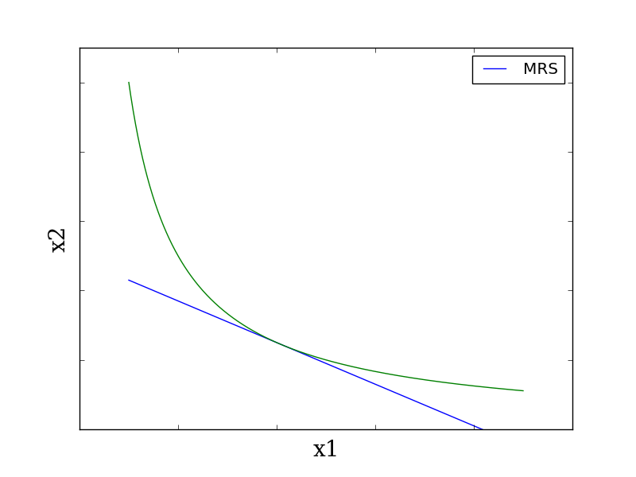

## 消費者行動（続き）

### 限界代替率

> 無差別曲線の接線の傾き（の絶対値）を、限界代替率（Marginal Rate of Substitution, MRS）と呼ぶ。
> 目的関数（この場合、u）の値を一定に保つという条件の下で、限られた資源を代替的な酔うとの間で、いかに変更（=代替）できるかを、微小単位の比率として表す概念。

第2財が第1財を代替する程度  
消費者にとって、第2財で測った第1財の価値  
PとQを比較した場合、第2財の第1財に対する限界代替率 $\mathrm{MRS}_{21}$ (MRS of $x_2$ for $x_1$)は、減少する。$x_1$ の希少性が $P > Q$ のため。  
→ 限界代替率逓減の法則という

### 限界効用と限界代替率の関係

第1財の消費量を1単位減少させると、効用は限界効用の大きさ $U_1(x_1, x_2)$ だけ減少する。
この減少を、第2財を増やすことで補うものとする。  
第2財を1単位増加 → 効用が $U_2(x_1, x_2)$ = 限界効用の大きさだけ増加  
逆に、  
効用を1単位増加させるためには、第2剤を $\dfrac{1}{U_2(x_1, x_2)}$ 単位だけ増加させればよい。  
よって、当初の効用の減少 $U_1(x_1, x_2)$ は、第2財を
$$U_1(x_1, x_2)\ \times \dfrac{1}{U_2(x_1, x_2)} = \dfrac{U_1(x_1, x_2)}{U_2(x_1, x_2)}$$
だけ増加させることによって補われる。よって、
$$\mathrm{MRS}_{21} = \dfrac{U_1(x_1, x_2)}{U_2(x_1, x_2)}$$
が成立する。
