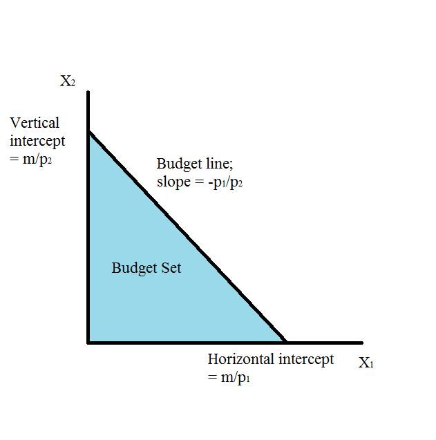
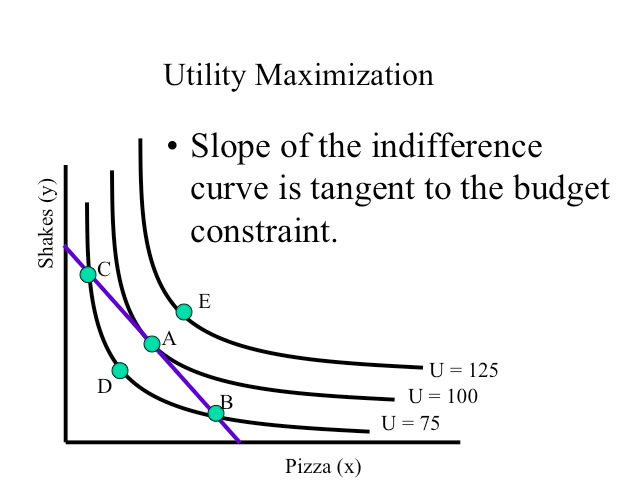

## 消費者行動（続き）

### 限界代替率

> 無差別曲線の接線の傾き（の絶対値）を、限界代替率（Marginal Rate of Substitution, MRS）と呼ぶ。
> 目的関数（この場合、u）の値を一定に保つという条件の下で、限られた資源を代替的な酔うとの間で、いかに変更（=代替）できるかを、微小単位の比率として表す概念。

第2財が第1財を代替する程度  
消費者にとって、第2財で測った第1財の価値  
PとQを比較した場合、第2財の第1財に対する限界代替率 $\mathrm{MRS}_{21}$ (MRS of $x_2$ for $x_1$)は、減少する。$x_1$ の希少性が $P > Q$ のため。  
→ 限界代替率逓減の法則という

### 限界効用と限界代替率の関係

第1財の消費量を1単位減少させると、効用は限界効用の大きさ $U_1(x_1, x_2)$ だけ減少する。
この減少を、第2財を増やすことで補うものとする。  
第2財を1単位増加 → 効用が $U_2(x_1, x_2)$ = 限界効用の大きさだけ増加  
逆に、  
効用を1単位増加させるためには、第2剤を $\dfrac{1}{U_2(x_1, x_2)}$ 単位だけ増加させればよい。  
よって、当初の効用の減少 $U_1(x_1, x_2)$ は、第2財を
$$U_1(x_1, x_2)\ \times \dfrac{1}{U_2(x_1, x_2)} = \dfrac{U_1(x_1, x_2)}{U_2(x_1, x_2)}$$
だけ増加させることによって補われる。よって、
$$\mathrm{MRS}_{21} = \dfrac{U_1(x_1, x_2)}{U_2(x_1, x_2)}$$
が成立する。

### 消費者の目的 = 効用の最大化を考える

現実の世界では、個人の予算に限りがあるので、これを考慮する。  
$\mathrm{Max}\ U(x_1, x_2)$  
$s.t\ (\mathrm{subject\ to})\ \ \ P_1x_1 + P_2x_2 = M \cdots \mathrm{予約制約式}$  
$given\ \ P_1, P_2, M$  
ただし、  
$P_1$：第1財の価格（ひとまず一定）
$P_2$：第2財の価格  
$x_1$：第1財の消費量  
$x_2$：第2財の消費量  
$M$：予算  

今、予算制約式は、下図のように描ける。線分$AB$上の点、および横軸縦軸でかこまれた領域が、選択可能な範囲。  
線分$AB$：予算線  
$\Delta ABO$：予算集合

これに無差別曲線（IC）を組み合わせる。　 
今、ある個人の無差別曲線は無数に描けるが、選択可能な$x_1$と$x_2$の組み合わせは、予算集合の中のみ。  
右上の無差別曲線ほど高い効用を示すので、無差別曲線と予算線が接する$A$が効用最大。  
$C$や$D$も選択可能だが、効用は最大化されていない。

$A$点は次の条件を満たす。（主体的均衡条件）  
$P_1x_1 + P_2x_2 = M \cdots \mathrm{予算制約式}$  
$\mathrm{MRS}_{21} = \dfrac{P_1}{P_2}$  
第2財の第1財に対する限界代替率が、2財の価格比に等しくなるように消費したときに、効用は最大。  
かつ$\mathrm{MRS}_{21}$は、2財の限界効用比$\dfrac{U_1(x_1, x_2)}{U_2(x_1, x_2)}$に等しいので、
$\dfrac{U_1(x_1, x_2)}{U_2(x_1, x_2)} = \dfrac{P_1}{P_2}$となる。

今、主体的均衡条件を満たす点を、
$$x^* = (x_1^*(P_1, P_2, M), x_2^*(P_1, P_2, M))$$
と書くことにする。  
$x_1^*(P_1, P_2, M)$：第1財の個別需要関数  
$x_2^*(P_1, P_2, M)$：第2財の個別需要関数

_個別需要関数の性質_  
1. $\left(\begin{array}{c} P_1 \\ P_2 \\ M \end{array}\right) \rightarrow \left(\begin{array}{c} kP_1 \\ kP_2 \\ kM \end{array}\right)$ ($k$: 定数)のとき、$x^*$はどのように変化するか。  
→ 変化しない  
名目価値の上昇は、$x^*$に影響_しない_  
→ 個別需要の0次同時性

2. $\left(\begin{array}{c} P_1 \\ P_2 \\ M \end{array}\right) \rightarrow \left(\begin{array}{c} P_1 \\ P_2 \\ kM \end{array}\right)$ ($k$: 1より大きい正の定数)のとき  
予算線が、_右上にシフト_  
2財の価格は不変なので、傾きは不変。
→ $x_1, x_2$の消費量が_増加する_。

所得が増加したときの最適消費を表す点を繋いだものを所得消費曲線と呼び、$x_1, x_2$ と $M$ の関係を描いたものを、エンゲル曲線と呼ぶ。  
通常、エンゲル曲線は右上がりの曲線。  
この場合、その財のことを正常財（上級財）と呼ぶ。
時として、エンゲル曲線が右下りになることがあり、この場合その財のことを劣等財（下級財）と呼ぶ。

